# Tweet Sentiment Analysis

**Author**: [Jin-hoon Chung](mailto:ddjh204@gmail.com)

# Overview
An investment company wants to invest in the stock of one of two companies, Apple and  Google. Visualizations and text summaries are included at the end.

#  Business Problem
An investment company is collecting information to make a decision before investing in the stock of one of two companies, Apple and Google, and they are interested in market performance based on customer reviews. One way to check the reviews is to check customerss tweet sentiments. Based on tweet sentiments, one of two companies will be recommended.

# Data Understanding
The dataset has 3 columns, Tweet text, brand, and emotion rating. The dataset contains more than 9000 texts.

# Data Cleaning
## Handling Missing Values
There is one missing value in the tweet_text column. Therefore, it is deleted.

## Renaming column names
Long column names are shortened for coding convenience and readability.

Old column name | New name
--- | ---
emotion_in_tweet_is_directed_at"                   | brand
is_there_an_emotion_directed_at_a_brand_or_product | emotion

## Tweet text cleaning
Below steps will do cleaning that is specifically designed for tweet texts. The reference is from this [link](https://towardsdatascience.com/another-twitter-sentiment-analysis-bb5b01ebad90). Steps below will be helpful tokenizing the texts.

1. Clean up HTML encodings by removing &amp, &quot, etc.
2. Clean up mentions by removing @mention.
3. Clean up URLs by removing them.
4. Pick only letters.

## Cleaning target columns
This would transform the brand column and emotion column in to columns with three categories.
### Frequency Check
Frequency of values are checked before merging same categories.

Below are the tables before merging.

Brand name | Count
--- | ---
iPad                              | 946
Apple                             | 661
iPad or iPhone App                | 470
Google                            | 430
iPhone                            | 297
Other Google product or service   | 293
Android App                       |  81
Android                           |  78
Other Apple product or service    |  35

Emotion | Count
--- | ---
No emotion toward brand or product   | 5388
Positive emotion                     | 2978
Negative emotion                     |  570
I can't tell                         |  156

### Categorization
Below shows how brand information is categorized.

Brand name | Category
--- | ---
'iPad or iPhone App', 'iPad', 'iPhone'      | Apple's mobile products
'Android App', 'Android'                    | Google's mobile products
'Apple', 'Other Google product or service'  | Apple's other products
'Google', 'Other Google product or service' | Apple's other products
missing                                     | None


# Analysis
The data can be separated into two sets, texts with brand information and texts without brand information. The texts with brand information are already categorized in the above step. The texts without brand information will be categorized by predicting what words exist in the texts. We will train the data using texts with available brand information, then use the trained model to predict/categorize texts without brand information.

The texts without brand information (64% of data) are not useful for now, but once the texts are categorized, much more information is gathered thus making findings more valuable.

## Brand Prediction
Before the analysis, the data is split into data with brand information and data without brand information. 

Using data_with_target data, prediction steps are started.

1. Encoding the target column.
2. Train-test split on data_with_target. The train set size is 75% of the whole data.

### Baseline Models
1. Two tokenizers - TfidfVectorizer and CountVectorizer both with 10 max_features
2. Four models - LogisticRegression, RandomForestClassifier, SVC, MultinomialNB

Model | Validation Score
--- | ---
Logistic Regression tfidf  | .814
Random Forest tfidf        | .805
Support Vector tfidf       | .822
Naive Bayes tfidf          | .749
Logistic Regression tfidf  | .815
Random Forest tfidf        | .805
Support Vector tfidf       | .816
Naive Bayes tfidf          | .799

Model | Accuracy Score
--- | ---
Logistic Regression tfidf  | .789
Random Forest tfidf        | .803
Support Vector tfidf       | .807
Naive Bayes tfidf          | .717
Logistic Regression tfidf  | .795
Random Forest tfidf        | .801
Support Vector tfidf       | .796
Naive Bayes tfidf          | .787


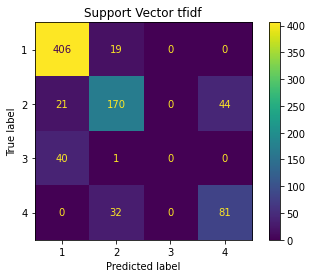
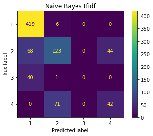
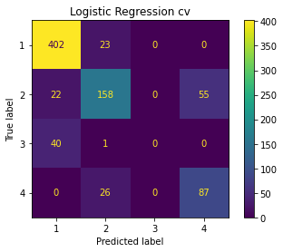


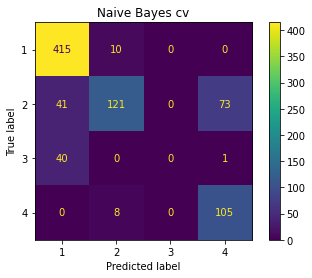

#### Baseline model selection summary
1. The highest validation score and accuracy score are found by using Tfidf vectorizer. Therefore, only Tfidf is kept for the further analysis.
2. Naive Bayes has the lowest scores, but this model is kept for the reference.
3. Confusion matrices shows '3' is barely predicted where '3' is Android or Google's mobile products. Hopefully, next section would capture more '3's. 

### Iterative Approach
####  Stopwords
The first iterative step is to filter stopwords on tfidf instantiation.

Model | Validation Score
--- | ---
Logistic Regression tfidf  | .848
Random Forest tfidf        | .850
Support Vector tfidf       | .854
Naive Bayes tfidf          | .803

Model | Accuracy Score
--- | ---
Logistic Regression tfidf  | .835
Random Forest tfidf        | .837
Support Vector tfidf       | .839
Naive Bayes tfidf          | .786

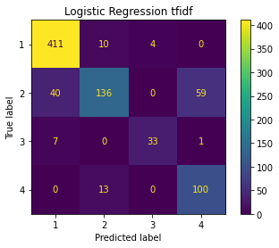
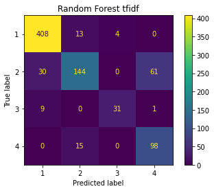
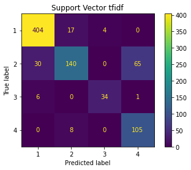


#### More summary
1. Validation scores and accuracy scores are improved.
2. Confusion matrices now catches more '3's except for Naive Bayes.

### Final Model Part 1
SVC model has the highest scores for both validation and accuracy. 

Max_features during tfidf instantiation is increased from 10 to 100 meaning it will select top 100 words instead of 10 words.

Validation score - .90
Accuracy score - .89


The scores are a lot more improved.

## Final Model Part 2

Gridsearch is used to see if SVC model can be improved, but he best parameters are just the default values. No further tuning is done.

## Merging Predicted Brand to the Data
The fitted final model is used to predict and categorize missing brand information.


# Result

## Visualization

- **Overall emotion percentages for Apple**
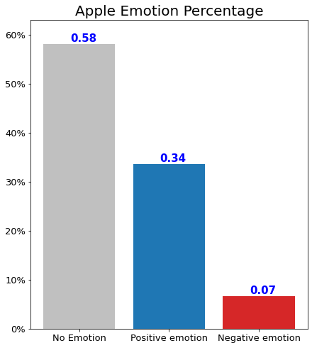

- **Emotion percentages for Apple's mobile products**
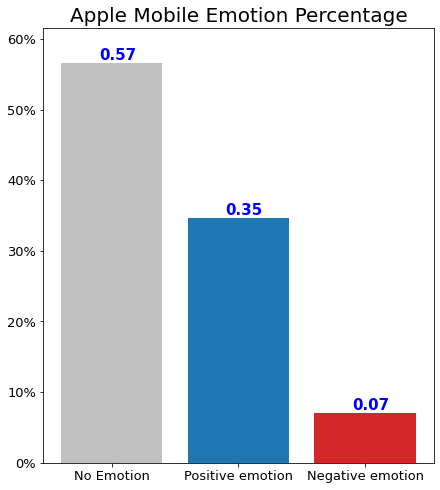

- **Emotion percentages for Apple's other products**
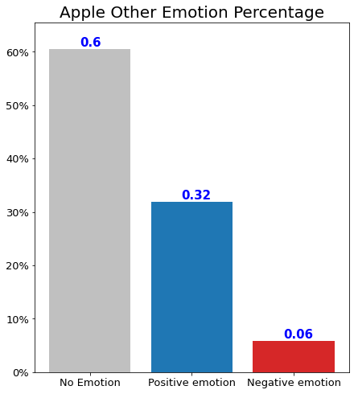

- **Overall emotion percentages for Google**
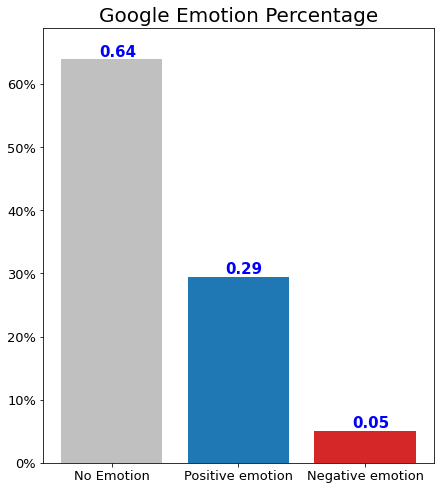

- **Emotion percentages for Google's mobile products**
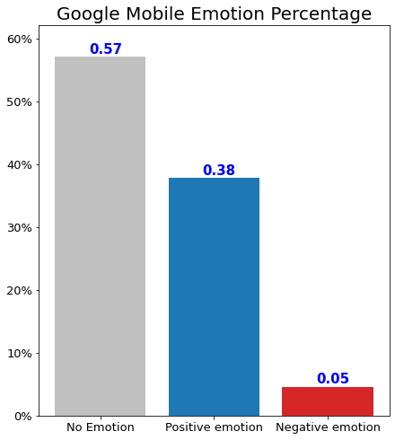

- **Emotion percentages for Google's other products**
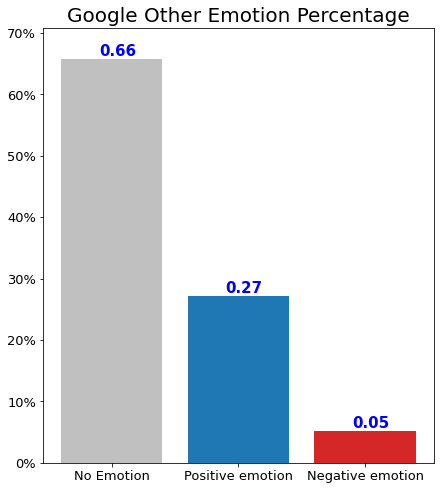

## The Most Frequent Words
- Keywords found in Apple's positive texts are sxsw, link, store, app, new, austin, launch, line, cool, circles.
- Keywords found in Google's positive texts are sxsw, link, party, app, new, mayer, great, mobile, social, search.

# Conclusions
- **Investing in Google is recommended vs. Apple because Google has a lower ratio of negative emotion by positive emotion.** 
- **Other than ‘sxsw’, ‘link’, ‘app’, ‘new’, two brands have different keywords found in their sentiments.**

## Next Steps
Further analysis could help the government gain more insight into understanding people without vaccination.

- **Select tweets including one or more keywords.** There are several words that appear in tweets much more frequently than the rest words. We can try to compare the positive rates based on tweets containing one or more keywords.
- **Investigate SXSW.** The most frequent keyword in sentiments is SXSW. It might mean something to seek a relationship between Apple and SXSW.
- Share the full list of keywords with the client.

# Repository Structure

```
├── code
│   ├── __init__.py
│   ├── data_preparation.py
│   └── visualizations.py
├── data
├── images
├── README.md
├── tweet_sentiment_analysis.ipynb
└── tweet_sentiment_analysis.pdf
```